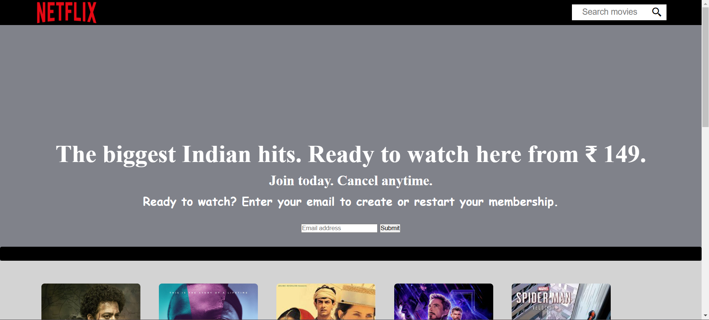

# 🎬 Netflix Clone (Single HTML File)

A simple Netflix clone built using **only one HTML file** with embedded CSS and JavaScript. This project demonstrates the structure and layout of Netflix's homepage, including a navbar, search functionality, featured section, and movie categories.

## 🔗 Live Demo

👉 [View Demo](https://delicate-tiramisu-7968ab.netlify.app/)

---

## ✨ Features

- ✅ Single HTML file for quick preview and deployment
- 🎥 Netflix-style layout
- 📱 Responsive design
- 🔍 Search bar UI
- 🎬 Dynamic sections for movies
- 📦 No external dependencies (except Font Awesome)

---

## 🧑‍💻 Technologies Used

- HTML5
- CSS3 (Embedded in `<style>`)
- JavaScript (Embedded in `<script>`)
- [Font Awesome](https://fontawesome.com/) for icons

---

## 🚀 How to Use

1. Clone the repository or [download the HTML file](https://github.com/your-username/netflix-clone-single/blob/main/index.html)
2. Open `index.html` in your browser
3. Done! 🎉

---

## 📁 File Structure
- index.html
- style.css
- script.js

  
---

## 🖼 Screenshot

---

## 🙌 Author

Made with ❤️ by [kundan kumar](https://github.com/kundan-2026)

